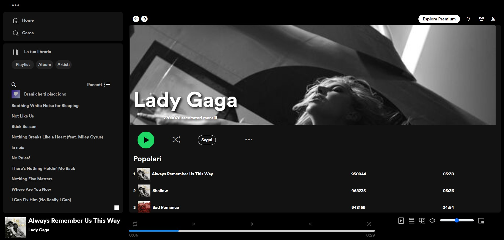

<h1>Spotify Clone - Frontend</h1>

Benvenuti nel Spotify Clone, un progetto frontend che replica alcune delle funzionalità chiave dell'applicazione di streaming musicale più popolare al mondo. Con questa piattaforma, gli utenti possono esplorare una vasta gamma di brani musicali, cercare artisti e brani, salvare le loro canzoni preferite e godersi brevi anteprime audio.

Funzionalità Principali:

Navigazione Intuitiva: L'interfaccia utente offre una navigazione intuitiva, consentendo agli utenti di esplorare facilmente le varie sezioni dell'applicazione, come le nuove uscite, le playlist popolari e altro ancora.

Ricerca Avanzata: Gli utenti possono utilizzare la barra di ricerca per cercare artisti, brani o album di loro interesse. La ricerca è veloce e accurata, fornendo risultati pertinenti in tempo reale.

Salvataggio di Preferiti: Gli utenti possono salvare le loro canzoni e artisti preferiti per accedervi facilmente in seguito. Questa funzionalità consente agli utenti di creare una libreria personalizzata di musica che riflette i loro gusti e le loro preferenze.

Riproduzione di Anteprime Audio: Utilizzando l'API di StriveSchool, gli utenti possono ascoltare brevi anteprime audio di 30 secondi dei brani musicali. Questa funzionalità offre loro un assaggio della musica disponibile, consentendo loro di scoprire nuovi brani e artisti.

Come Utilizzare:

Esplora le Opzioni di Navigazione: Utilizza il menu di navigazione per esplorare le varie sezioni dell'applicazione, come le nuove uscite, le playlist consigliate e altro ancora.

Effettua una Ricerca: Utilizza la barra di ricerca per cercare artisti, brani o album specifici. I risultati della ricerca verranno visualizzati in tempo reale mentre digiti.

Salva i tuoi Preferiti: Durante la navigazione, puoi fare clic sull'opzione di salvataggio per aggiungere le tue canzoni e artisti preferiti alla tua libreria personale.

Ascolta le Anteprime Audio: Nella pagina dei risultati della ricerca o nella pagina del brano, puoi fare clic sull'opzione per riprodurre l'anteprima audio di 30 secondi del brano.

Crediti:

Il frontend del Spotify Clone è stato sviluppato con passione da <a href="https://www.linkedin.com/in/trixiamarielorenzana/" target="_blank">Trixia Marie Lorenzana </a>, <a  href="https://github.com/0znerol" target="_blank">Lorenzo Pezzica </a>, <a  href="https://www.linkedin.com/in/maria-tavino-029a8629b/" target="_blank">Maria Tavino</a>, <a  href="https://www.linkedin.com/in/marcopetruzzella00/" target="_blank">Marco Petruzzella</a> e <a  href="https://www.linkedin.com/in/celine-fatima-emanuele-webdeveloper/" target="_blank">Celine Emanuele</a>.
